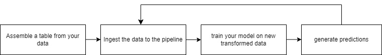

# Project Charter

## Business background
* Who is the client, what business domain the client is in. 
There are many potential clients who may find the Boston Housing dataset useful. For example, the dataset could be used by real estate professionals or investors to better understand housing trends and patterns in the Boston area. It could also be used by policymakers or urban planners to gain insight into the housing market and to develop strategies for addressing issues such as affordability and accessibility. Additionally, the dataset could be of interest to researchers and students studying.

## Scope
* What data science solutions are we trying to build? 
As a solution to our research question, we aim to develop generic pipeline that will clean, preprocess and transform all data types. 
further more we wish to imporve our data with feature selection techniques and data resampling/reweighting in order to imporve our baselines. 
* What will we do? 
We will create a generic pipeline with one of the familiar packages that will handle different types of data and transform them to numeric values (one-hot-encoding, mapping, imputing) as part of preprocessing, we also aim that our pipeline will create a model (as a subprocess) that will tell us if our data is not balanced and needs to be resampled/reweighted, along side with data cleansing apporachs such as outliers removal. 
We also aim to create a pipeline step that will perform feature-selection on the propogated data, feature-selection model will be generic as well and could be changed by providing model names. 
* How is it going to be consumed by the customer? 
To all of our cool customers, you can simply copy our pipeline implementation and run it in your environments. 
Playing with different pipeline params is advised ! 

## Personnel
* Our team:
	* Gydi:
		* Project lead
		* Data Engineer
		* Data scientist(s)
		* Customer support
	* Client:
		* Data administrator
		* Head of science
	
## Metrics
* What are the qualitative objectives? (e.g. reduce user churn) 
* Gydy will reduce machine learning research time and will improve your baselines scores by providing generic pipelines. 
* What is a quantifiable metric  (e.g. reduce the fraction of users with 4-week inactivity) 
* Increase baseline models MAE, RMSE and more, reduce research & implementation time. 
* Quantify what improvement in the values of the metrics are useful for the customer scenario (e.g. reduce the  fraction of users with 4-week inactivity by 20%)  
* Performing generic feature-selection, data reweighting and cleaning will ensure reduced deployment time and increase model scores. 
* What is the baseline (current) value of the metric? (e.g. current fraction of users with 4-week inactivity = 60%) 
* We benchmark xgb regressor with two datasets, boston house price (2.87 MAE) and french motor (0.003 MAE) 
* How will we measure the metric? (e.g. A/B test on a specified subset for a specified period; or comparison of performance after implementation to baseline) 
* We will compare our improved baseline with market common implementations with several datasets. 

## Plan
* Phases (milestones), timeline, short description of what we'll do in each phase.
* Phase 1 - Getting datasets, EDA.
* Phase 2 - Getting baseline models.
* Phase 3 - Research for existing tools to answer our problem.
* Phase 4 - Focus on several tools and test them.
* Phase 5 - Create a pipeline with best tools.

## Architecture
* Data
  * What data do we expect? Raw data in the customer data sources (e.g. on-prem files, SQL, on-prem Hadoop etc.)
  * We expact that customer's data will be able to fit in a dataframe (csv, parquet, json etc) and on prem files, further integration with spark will be supported.
* Data movement from on-prem to Azure using ADF or other data movement tools (Azcopy, EventHub etc.) to move either
  * Sampled data enough for modeling 

* What tools and data storage/analytics resources will be used in the solution e.g.,
  * Pandas for data storage
  * SKlearn's stat filters and models.
  * SKlearn's pipeline for pipeline creation
* How will the score or operationalized web service(s) (RRS and/or BES) be consumed in the business workflow of the customer? If applicable, write down pseudo code for the APIs of the web service calls.
our pipeline will be fused in each of the data-scientists day-to-day work, with easy implementation and customization.
  * How will the customer use the model results to make decisions
  * The customer will view model scores and will decide whether to choose different pipeline params or not.
  * Data movement pipeline in production
  * In production, a serving function / serving graph holding the pipeline implementation for easy data manipulation in production.
  * When files are stored on cloud providers, proper credentials has to be declared.
  * Make a 1 slide diagram showing the end to end data flow and decision architecture
  
    * If there is a substantial change in the customer's business workflow, make a before/after diagram showing the data flow.

## Communication
* Our team for this project:
	* Daniel Sabba
	* Yossi Gavriel
	* Jonathan Erell
	* Guy Sedan 
	
* Who are the contact persons on both sides?
* Yossi Gavriel
* DR. Ishay
