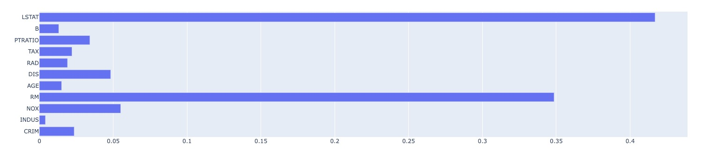
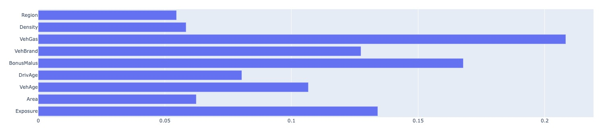
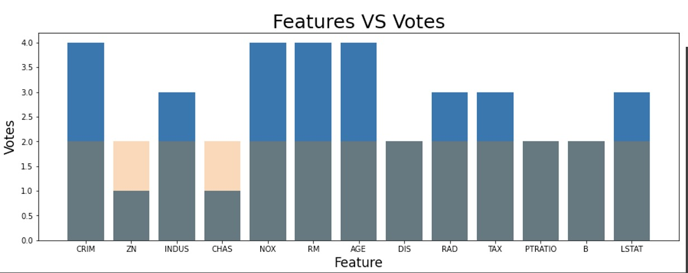
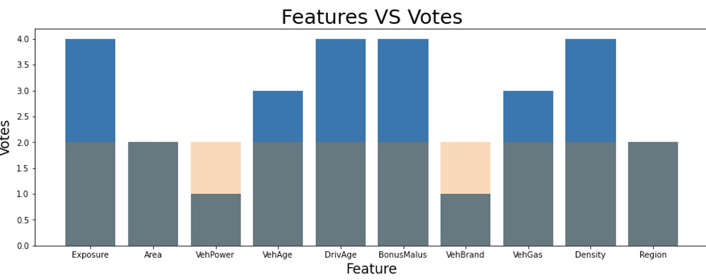

# Final Model Report
_Report describing the final model to be delivered - typically comprised of one or more of the models built during the life of the project_

## Analytic Approach
* our goal is to explora our pipeline results on the created pipeline, to help us understand how did we improved the baselines.
* the inputs are two different datasets. boston housing prices and french motor claim, both helds 10~13 features, The former is smaller then the latter.
* Using xgboost model.

## Solution Description
* We created a generic pipeline that accepts a datasource, ingest the data into our pipeline which performs feature-selection, outlier-removal and data-reweiging.
* our pipeline will generate plots - model's feature-importance,feature-selection voting matrices and scores.

## Data
* local csv file.
* Any scheme is allowed.
* using 80/20 test-split

## Features
* List of raw and derived features 
* Importance ranking.

## Algorithm
Models and Parameters
* First function - get_data
** fetching the data from source, the user capable of adding his own function handlers to fetch from other datasources. ** apply custom preprocess e.g one hot encoding, imputing.
* Second function - feature-selection
** function imported from mlrun's function marketplace to play a generic step in the pipeline, will calculate feature importance based on sklearn's univariate feature-selection classes (statistic models).
* Third function - outliner-removal
** custom implementation of outlier removal using pyod and IQR.
* Fourth function - dalex
** performing data reweighing / sampling using dalex package
* last function - auto_trainer
** mlrun wrappes different machine learning frameworks to orchestrate into the kubeflow pipeline
XGBoost model.
The only hypter parameter is the random_state.

## Results
housing pipeline feature importance : 

boston pipeline feature importance : 

housing voting (feature-selection) : 

motor voting (feature-selection) : 

