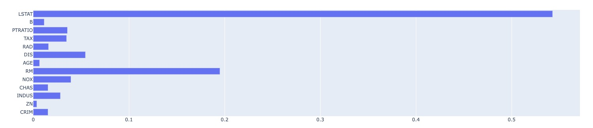
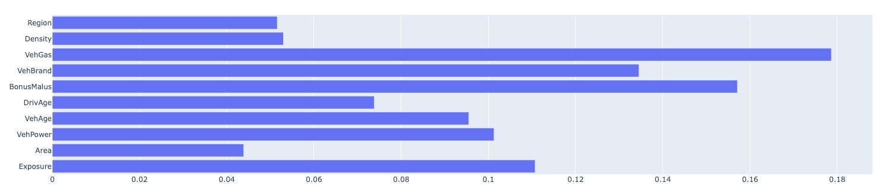

# Baseline Model Report

_Baseline model is the the model a data scientist would train and evaluate quickly after he/she has the first (preliminary) feature set ready for the machine learning modeling. Through building the baseline model, the data scientist can have a quick assessment of the feasibility of the machine learning task._

> If using MLRun functions - auto_trainer and feature_selection various plots are generated continiously. 

## Analytic Approach
* our goal is to explora our pipeline results on the baselines, to help us understand how did we improved
* the inputs are two different datasets. boston housing prices and french motor claim, both helds 10~13 features, The former is smaller then the latter.
* Using xgboost model as baseline

## Model Description

* Models and Parameters
	* First function - get_data 
	** fetching the data from source, the user capable of adding his own function handlers to fetch from other datasources.
	** apply custom preprocess e.g one hot encoding, imputing.
	* Second function - auto_trainer
	** mlrun wrappes different machine learning frameworks to orchestrate into the kubeflow pipeline
	* XGBoost model.
	* The only hypter parameter is the random_state.

## Results (Model Performance)
Boston :
* MSE 13.233
* RMSE 3.637
* MAE 2.642
* R2 0.873

french motor :
* MSE 0.056
* RMSE 0.236
* MAE 0.097
* R2 0.0429

housing baseline feature importance : 

boston baseline feature importance : 

## Model Understanding

* Using feature importance we can see what features infulence the most.

* using R2 we can see that the data is well fitted.

## Conclusion and Discussions for Next Steps

* How can we imporve the biased feature importance ?

* How can we further refine our data

* What other Features Can Be Generated from the Current Data

* What are available machine learning life cycle frameworks available
